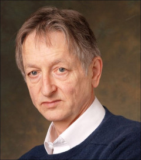
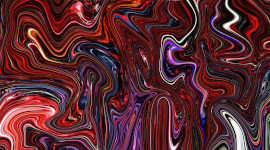
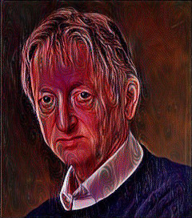

# Neural-Style-Transfer
> Neural Style Transfer with VGG19

The project illustrates Neural Style Transfer, a technique of combining the content properties of a content image and the style properties of a style image, to produce a hybrid image.
It uses VGG19 model, pretrained on the ImageNet dataset, to extract different features of an image.

## Demo

### Content Image

### Style Image

### Generated Image

## Usage

View some other styled images of Geoffrey Hinton, Yann Lecun and Yoshua Bengio in the ``Generated`` directory.
Run the jupyter notebook ``Neural Style Transfer.ipynb`` to view code/implementation.
